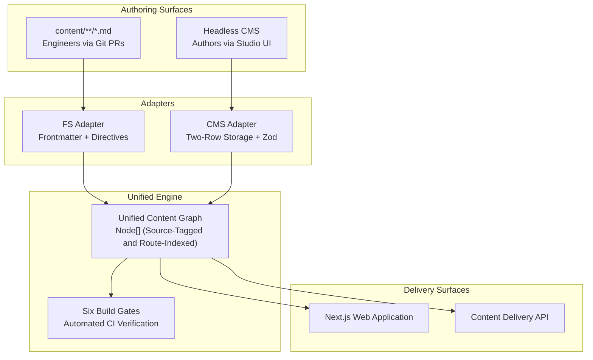

# AtomicBinding (Imprint)

<p align="center">
  
  
  
  
  
</p>

<p align="center">
  
  
  
  
  
  
  
</p>

---

## Table of Contents

- [AtomicBinding (Imprint)](#atomicbinding-imprint)
  - [Table of Contents](#table-of-contents)
  - [Project Overview](#project-overview)
  - [Core Features](#core-features)
  - [System Architecture](#system-architecture)
    - [Single Source of Truth Model](#single-source-of-truth-model)
    - [Data Ingestion Pipeline](#data-ingestion-pipeline)
    - [Type-Safe Binding Compiler](#type-safe-binding-compiler)
  - [Prerequisites](#prerequisites)
  - [Local Development Setup](#local-development-setup)
    - [1. Clone the Repository](#1-clone-the-repository)
    - [2. Install Dependencies](#2-install-dependencies)
    - [3. Configure Environment Variables](#3-configure-environment-variables)
    - [4. Initialize Database and Seed Content](#4-initialize-database-and-seed-content)
    - [5. Start Development Server](#5-start-development-server)
  - [Local Access Points](#local-access-points)
  - [Environment Configuration Guide](#environment-configuration-guide)
  - [Deterministic Build Gates](#deterministic-build-gates)
  - [Available CLI Scripts](#available-cli-scripts)
  - [Project Directory Structure](#project-directory-structure)
  - [Troubleshooting Guide](#troubleshooting-guide)
    - [1. Missing Environment File (`cp .env.example .env.local` fails)](#1-missing-environment-file-cp-envexample-envlocal-fails)
    - [2. Node.js Version Mismatch](#2-nodejs-version-mismatch)
    - [3. Port Conflict (Port 3100 already in use)](#3-port-conflict-port-3100-already-in-use)
    - [4. Database Initialization Issues](#4-database-initialization-issues)
    - [5. Build Gate Failures](#5-build-gate-failures)
  - [Contributing Guidelines](#contributing-guidelines)
  - [Contributors](#contributors)
  - [License](#license)

---

## Project Overview

Modern content infrastructure presents a dilemma: engineering teams prefer Git-backed Markdown with structured pull request workflows, while marketing and product teams require headless CMS interfaces with intuitive form controls.

**AtomicBinding (Imprint)** reconciles these models. Markdown documentation from Git and relational entities from the CMS are ingested and normalised into a single unified, strongly-typed content graph (`Node[]`). Downstream consumers (such as Next.js React components and API routes) render from this graph seamlessly without branching on the content source origin. Six automated build gates guard the graph to guarantee type safety, link integrity, and prevent schema drift in production.

---

## Core Features

- **Dual-Source Normalisation**: Unifies Git-tracked Markdown frontmatter and SQLite/Postgres database records into a single consolidated graph.
- **Zero-Codegen Schema Architecture**: A single TypeScript schema definition drives runtime validation, Studio form rendering, delivery API schemas, React component props, and CI build invariants.
- **Mathematical Binding Compiler**: Compiles flat `{ source, target }` rows into strongly-typed UI components with round-trip verification (`compile(decompile(rows)) === rows`).
- **Six Deterministic Build Gates**: Automated CI validations that catch route collisions, broken hyperlinks, unresolved foreign references, and schema violations.
- **Embedded Studio Engine**: Provides real-time visual schema editing and draft preview capabilities over postMessage iframe communication.

---

## System Architecture

### Single Source of Truth Model

Every document and block type is declared exactly once in `schema/` using primitives like `defineDocument` and `defineBlock`. This unified definition drives five distinct system boundaries:

1. **Storage and Write Path**: Compiles into a runtime Zod validator enforcing database and API constraints.
2. **Editor Manifest**: Directs the Studio UI to render context-aware form controls.
3. **Delivery API Contract**: Defines the JSON schema and serialization structure for API consumers.
4. **Render Props**: Provides compile-time TypeScript type definitions to React components.
5. **Build Gates**: Generates invariants checked across the entire content graph prior to release.

### Data Ingestion Pipeline



### Type-Safe Binding Compiler

Dynamic feeds (such as integration directories or changelog listings) bind to target UI cards. While persisted as flat `{ source, target }` rows for performance, the authoring surface uses compile-time checked mappings:

```typescript
bind(integrations, integrationCard)
  .replicate()
  .map({
    title: (i) => i.title,
    image: (i) => i.logo.absolutePath,
    href:  (i) => i.route,
  });
```

The binding compiler guarantees type integrity: referencing invalid fields or type mismatches triggers compilation failures before runtime execution.

---

## Prerequisites

Ensure your environment satisfies the following minimum system requirements:

| Dependency  | Minimum Version | Verification Command |
| ----------- | --------------- | -------------------- |
| **Node.js** | `>= 22.5.0`     | `node -v`            |
| **npm**     | `>= 10.0.0`     | `npm -v`             |
| **Git**     | `>= 2.30.0`     | `git -v`             |

---

## Local Development Setup

Follow these steps to configure and launch the development environment locally:

### 1. Clone the Repository

```bash
git clone https://github.com/SrishtiSonam/AtomicBinding.git
```

### 2. Install Dependencies

```bash
npm install
```

### 3. Configure Environment Variables

Create your local environment configuration from the provided template:

```bash
cp .env.example .env.local
```

Open `.env.local` and configure your development token and paths:

```env
IMPRINT_TOKEN=dev-secret-token-change-me
IMPRINT_DRIVER=sqlite
IMPRINT_SQLITE_PATH=./data/imprint.db
IMPRINT_STUDIO_ORIGIN=http://localhost:3100
```

### 4. Initialize Database and Seed Content

Run the database migration and seed script to populate baseline schema entities and sample records:

```bash
npm run seed -- --reset --legacy
```

### 5. Start Development Server

```bash
npm run dev
```

Navigate to `http://localhost:3100` in your web browser.

---

## Local Access Points

| Route                                 | Description                                                      |
| ------------------------------------- | ---------------------------------------------------------------- |
| `http://localhost:3100`               | Public website serving unified Git documentation and CMS content |
| `http://localhost:3100/studio`        | Headless Content Studio with visual schema form controls         |
| `http://localhost:3100/studio/health` | System health overview and diagnostic status of build gates      |

---

## Environment Configuration Guide

AtomicBinding uses the following environment variables. Default values are pre-configured in `.env.example`:

| Variable                | Type     | Default Value                | Description                                                                         |
| ----------------------- | -------- | ---------------------------- | ----------------------------------------------------------------------------------- |
| `IMPRINT_TOKEN`         | Required | `dev-secret-token-change-me` | Bearer token used for authenticating draft preview reads and write endpoints.       |
| `IMPRINT_DRIVER`        | Optional | `sqlite`                     | Primary storage engine backend (`sqlite` or `postgres`).                            |
| `IMPRINT_SQLITE_PATH`   | Optional | `./data/imprint.db`          | Local filesystem path for the SQLite database file.                                 |
| `IMPRINT_STUDIO_ORIGIN` | Optional | `http://localhost:3100`      | Allowed cross-origin domain for iframe communication between Studio and Canvas.     |
| `NO_COLOR`              | Optional | *(unset)*                    | When set to `1` or `true`, disables ANSI terminal color formatting in CLI commands. |

---

## Deterministic Build Gates

Six automated build gates validate the content graph during build steps and CI runs. Any validation failure halts execution with exit code `1`:

| Gate                     | Validation Target                                     | Failure Mode Prevented                                                      |
| ------------------------ | ----------------------------------------------------- | --------------------------------------------------------------------------- |
| **Route Uniqueness**     | Verifies route collisions across Git and CMS sources. | Prevents silent page overwrites and ambiguous route resolution.             |
| **Link Integrity**       | Traces every internal hyperlink (`from -> to`).       | Prevents broken 404 links across documentation and marketing pages.         |
| **Reference Resolution** | Checks foreign key references across graph nodes.     | Identifies dangling entity references and reports the holding field.        |
| **Schema Validity**      | Validates documents against current schema versions.  | Reports structural incompatibilities gracefully instead of runtime crashes. |
| **Binding Validity**     | Validates feed bindings against target brand types.   | Prevents field missing errors in dynamic UI card collections.               |
| **Binding Round-Trip**   | Tests bi-directional compile and decompile paths.     | Guarantees lossless persistence and schema transformation fidelity.         |

---

## Available CLI Scripts

The root workspace provides commands for local development, database operations, and quality assurance:

```bash
# Development and Build
npm run dev                 # Start Next.js development server on port 3100
npm run build               # Compile production application bundle
npm run start               # Launch production server on port 3100

# Verification and Testing
npm run typecheck           # Run TypeScript strict typecheck across all workspaces
npm test                    # Execute test suite using Vitest
npm test:watch              # Run Vitest test runner in watch mode
npm run gates               # Run all six deterministic build gates against current graph
npm run doctor              # Diagnose sources, types, migrations, and gate health

# Database Management
npm run migrate             # Perform dry-run of pending database migrations
npm run migrate -- --apply  # Apply pending migrations to database
npm run seed                # Populate database with seed data (--reset, --legacy)
```

---

## Project Directory Structure

```text
AtomicBinding/
├── app/                  # Next.js App Router (routes, layouts, API endpoints)
├── content/              # Git-tracked Markdown documentation and blog entries
│   ├── blog/             # Blog posts and articles
│   └── docs/             # Technical documentation and guides
├── migrations/           # Database migration definitions (SQLite and PostgreSQL DDL)
├── packages/
│   ├── cli/              # Imprint CLI tools (doctor, gates, migrate, seed)
│   ├── graph/            # Unified content graph and gate validation logic
│   ├── schema/           # Schema definition primitives and binding compiler
│   └── store/            # Storage adapters and two-row persistence engine
├── schema/               # Application-level schemas and ownership manifests
│   ├── blocks/           # Reusable block definitions
│   ├── cards.ts          # UI card schema declarations
│   ├── feeds.ts          # Content feed definitions
│   └── index.ts          # Main schema registry and ownership manifest
├── src/
│   ├── lib/              # Shared utilities and authentication middleware
│   ├── render/           # Component renderers and canvas integration
│   └── studio/           # Headless CMS Studio UI and dynamic form components
├── test/                 # Vitest test suites (schema, storage, gates, bindings)
├── .env.example          # Environment variable template
├── package.json          # Root workspace configuration and scripts
└── tsconfig.json         # TypeScript configuration
```

---

## Troubleshooting Guide

### 1. Missing Environment File (`cp .env.example .env.local` fails)
Ensure you are in the repository root. A template file `.env.example` is provided in the repository root. Copy it using:
```bash
cp .env.example .env.local
```

### 2. Node.js Version Mismatch
This repository requires Node.js version `22.5.0` or higher. Check your version with:
```bash
node -v
```
If using `nvm` (Node Version Manager), switch to Node 22:
```bash
nvm install 22
nvm use 22
```

### 3. Port Conflict (Port 3100 already in use)
Next.js is configured to run on port `3100`. If port 3100 is occupied:
- Stop any existing process occupying the port.
- Or specify an alternate port:
```bash
npm run dev -- -p 3200
```
Remember to update `IMPRINT_STUDIO_ORIGIN` in `.env.local` if changing ports.

### 4. Database Initialization Issues
If you encounter database lock or corruption issues during development, reset the local SQLite store:
```bash
npm run seed -- --reset --legacy
```

### 5. Build Gate Failures
To identify exact failure points across routes, references, or bindings, run:
```bash
npm run gates
```
Use `npm run doctor` to get an itemised diagnostic report of all registered types, sources, and migrations.

---

## Contributing Guidelines

Contributions are welcome. Please adhere to the following workflow:

1. **Fork the Repository**: Fork the project on GitHub to your account.
2. **Clone and Setup Upstream**:
   ```bash
   git clone https://github.com/<your-username>/AtomicBinding.git
   git remote add upstream https://github.com/SrishtiSonam/AtomicBinding.git
   ```
3. **Create a Feature Branch**:
   ```bash
   git checkout -b fix/issue-description
   ```
4. **Configure Local Environment**: Follow the [Local Development Setup](#local-development-setup) instructions.
5. **Enforce Quality Standards**:
   - Maintain strict TypeScript type safety without `any`.
   - Preserve existing schema definitions and validation invariants.
   - Run validation before pushing:
     ```bash
     npm run typecheck
     npm run gates
     npm test
     ```
6. **Submit a Pull Request**: Push your branch to your fork and submit a Pull Request to `upstream/main` with a clear description of the resolved issue.

---

## Contributors

Thank you to all contributors who participate in building and improving AtomicBinding.

<p align="center">
  <a href="https://github.com/SrishtiSonam/AtomicBinding/graphs/contributors">
    
  </a>
</p>

---

## License

This project is open source and available under the terms specified in the repository license.
